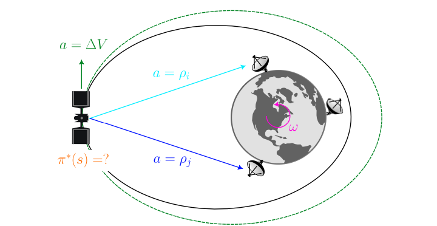
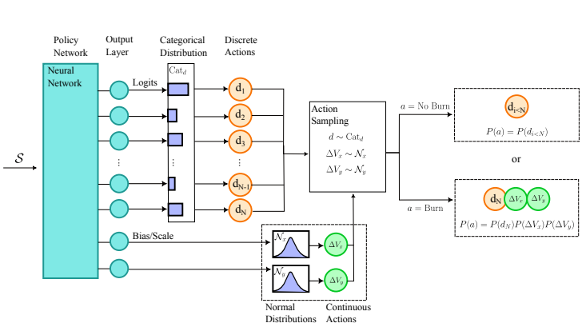

# OrbitalOps-Env (OpenEnv)

**Autonomous Spacecraft Navigation & Environment Characterization Benchmark**

  

## 1. Motivation & Real-World Utility

**OrbitalOps-Env** is a high-fidelity, deterministic Reinforcement Learning environment built natively on the OpenEnv SDK.

The environment directly simulates the mission-critical challenges outlined in the 2024 NASA Goddard / University of Maryland preprint: ***"Reinforcement Learning for Spacecraft Navigation & Environment Characterization in the Planar-Restricted Two-Body Problem" (AAS 25-285)***.

Current autonomous spacecraft face a profound sequential decision-making dilemma - **Navigation vs. Actuation**.

* **Navigation:** To reduce state uncertainty (a proxy for a Kalman Filter covariance), the spacecraft must track ground stations. However, stations are only visible during specific orbital windows.
* **Actuation:** To change orbits and reach those visibility windows, the spacecraft must fire its thrusters (Maneuver). However, maneuvers introduce **Execution Error**, causing an immediate and dangerous *spike* in positional uncertainty.

**Why this demands Reinforcement Learning:** A greedy, zero-shot LLM agent will often refuse to maneuver to save fuel and avoid the uncertainty penalty. A trained RL agent learns long-horizon planning - accepting a high-cost maneuver at Step 10 to guarantee a stable tracking window at Step 50.

<p align="center">
  
  <br>
  <em>Figure 1: Representation of the planar, 2D spacecraft navigation problem with ground station tracking and maneuver actions.</em>
</p>

---

## 2. Environment Mechanics (The MDP)

The underlying physics engine uses a **Runge-Kutta 4 (RK4)** integrator to simulate the Planar-Restricted Two-Body Problem (PR2BP), incorporating Earth's standard gravitational parameter ($\mu = 3.986 \times 10^5$).

### Observation Space (Strict Pydantic Schema)

The agent receives a heavily structured telemetry payload at each step ($dt = 120s$):

* `time_step`: Current simulation step (0 to 200).
* `position_x`, `position_y`: Orbital coordinates (km).
* `velocity_x`, `velocity_y`: Orbital velocities (km/s).
* `fuel_remaining`: Available $\Delta V$ budget.
* `positional_uncertainty`: Current state error (km). Natural drift occurs at +0.2km/step.
* `visible_stations`: Array of Ground Stations currently above the spacecraft's local horizon.

### Action Space (Parametric)

Modeled after the paper's parametric discrete/continuous formulation:

* `IDLE`: Do nothing. Conserves fuel, but `positional_uncertainty` slowly drifts higher.
* `TRACK(station_id)`: Locks onto a visible ground station.
* `MANEUVER(dv_x, dv_y)`: Fires thrusters to alter the trajectory.

<p align="center">
  
  <br>
  <em>Figure 2: The Parametric Action Space. The agent chooses between discrete actions (Track/Idle) and continuous control actions (Maneuver Delta-V).</em>
</p>

### 🧮 Astrodynamics & Physics Engine
The environment utilizes a custom **Runge-Kutta 4 (RK4)** numerical integrator to solve the Planar-Restricted Two-Body Problem (PR2BP). 
Gravitational acceleration is strictly calculated as:

$$ a_x = -\mu \frac{x}{(x^2 + y^2)^{3/2}}, \quad a_y = -\mu \frac{y}{(x^2 + y^2)^{3/2}} $$

Where $\mu = 3.986 \times 10^5 \text{ km}^3/\text{s}^2$ (Earth's standard gravitational parameter).

### 📡 The Uncertainty Formula (RL Credit Assignment)
The state uncertainty $\sigma$ (a proxy for Kalman Filter covariance) updates via:
1. **Process Noise:** $\sigma_{t+1} = \sigma_t + 0.2$ (Natural orbital drift)
2. **Measurement Update:** $\sigma_{t+1} = 1.0$ (Triggered by `TRACK` action on visible station)
3. **Execution Error:** $\sigma_{t+1} = \sigma_t + 2.0 + (|\Delta V| \times 10)$ (Triggered by `MANEUVER`)

*This formulation explicitly creates a delayed-reward constraint environment.*

### Reward Shaping & Punishments (Dense Signal)

The reward function provides dense, continuous gradients to solve the credit assignment problem:

* **[+1.0] Tracking Reward:** Successfully executing a `TRACK` action on a visible station collapses `positional_uncertainty` to $1.0km$.
* **[-1.0] Actuation Penalty:** Firing thrusters consumes fuel and subtracts from the reward.
* **Execution Error (The Trap):** A `MANEUVER` causes uncertainty to instantly spike by $2.0 + |\Delta V| \times 10$. If an agent spams maneuvers, it will blind itself.
* **[-10.0] Catastrophic Failure:** The episode instantly terminates if the spacecraft crashes ($r < 6371km$), escapes Earth orbit ($r > 100,000km$), or if `positional_uncertainty` exceeds $100km$ (Lost Signal).

---

## 3. Task Difficulty & Programmatic Graders

We provide 3 tasks with rigorous, deterministic 0.0-1.0 graders based strictly on physical survival and trajectory optimization.

| Task | Scenario | RL Objective | Grader Logic |
| :--- | :--- | :--- | :--- |
| **Task_1_Easy** | Stable circular orbit ($7500km$). Stations pass regularly. | Learn tool-calling. Track stations when visible, idle otherwise. | Score scales based on keeping average uncertainty < $10km$. Penalty for wasting fuel. |
| **Task_2_Medium** | Highly elliptical orbit. Stations rarely visible. | Orbital phasing. Must execute a maneuver at apoapsis to circularize the orbit. | Score scales based on total steps spent in communication with a visible ground station. |
| **Task_3_Hard** | **Rescue Mission:** High uncertainty ($90km$), Low fuel ($5\%$). | Survival under extreme constraints. Must execute a precise retrograde burn to speed up orbit and reach a station before uncertainty hits $100km$. | Binary/Survival fraction. 1.0 if the spacecraft survives 200 steps without getting lost. |

---

## 4. Baseline Evaluation (Frontier LLM Validation)

To prove that this environment genuinely challenges frontier models, we evaluated it using an open-weights frontier model (**Qwen 3 32B**) via the OpenEnv `inference.py` script.

**Results:**

```json
{
    "Task_1_Easy": 0.983,
    "Task_2_Medium": 1.000,
    "Task_3_Hard": 0.040
}
```

**Conclusion:** The LLM effortlessly masters the basic API controls (Task 1). However, zero-shot LLMs lack the intrinsic physics simulation capacity to calculate optimal orbital transfers (Task 2) or execute constrained emergency burns (Task 3). **This mathematically proves the necessity for dedicated Reinforcement Learning exploration in this domain.**

---

## 5. Local Setup & Usage

This project natively utilizes the official `openenv` Meta SDK.

**1. Install Dependencies**

```bash
pip install openenv fastapi uvicorn pydantic openai
```

**2. Run the OpenEnv Validation**

```bash
openenv validate .
```

**3. Run the Inference Agent locally**

```bash
# Uses the mandatory inference.py schema
python inference.py
```

**4. Start the API Server**

```bash
python -m uvicorn server.app:app --port 8000
```

***
